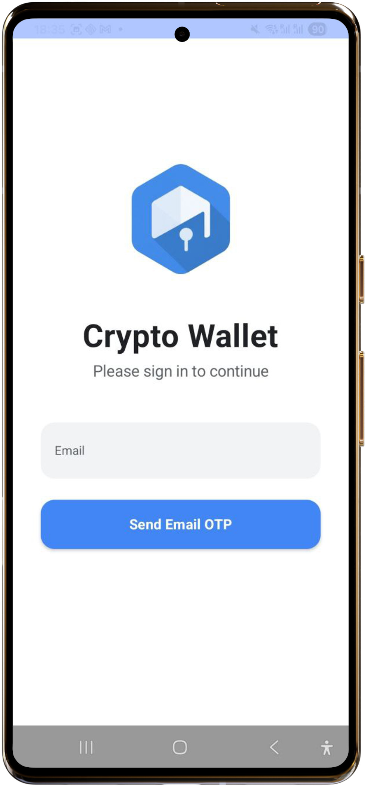
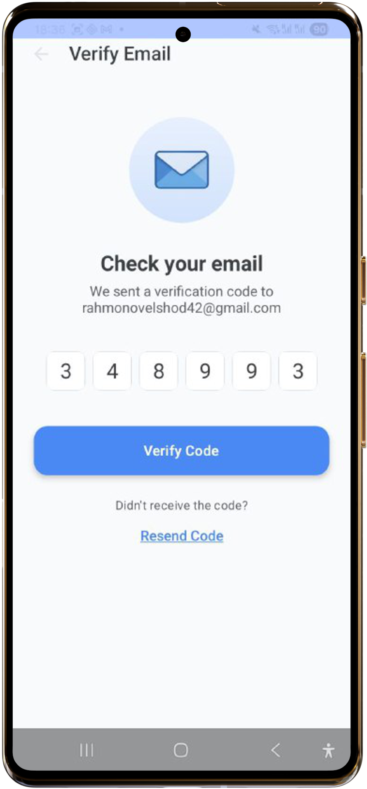
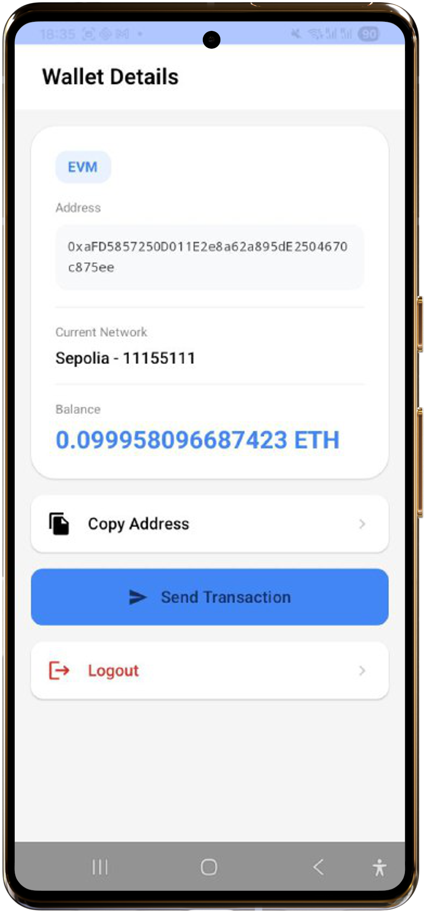
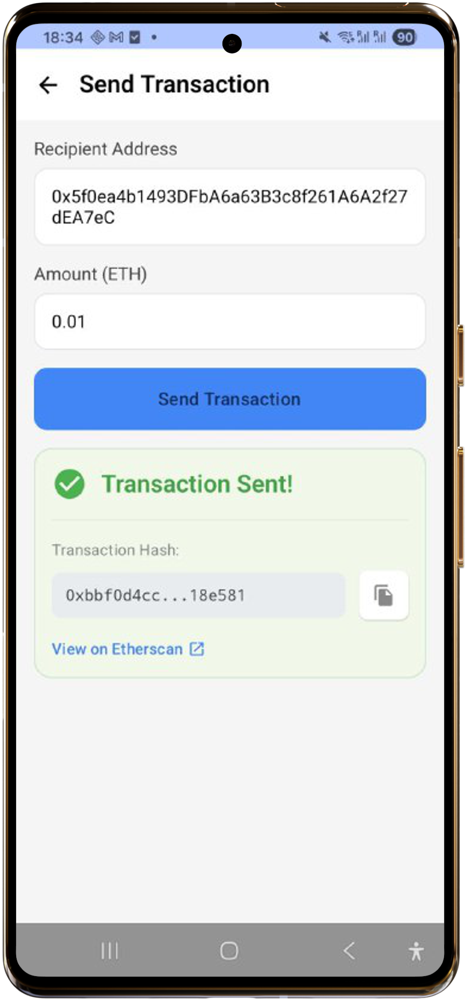

# 🚀 Crypto Wallet Android App

A modern Android crypto wallet application built with Jetpack Compose, enabling users to authenticate via email OTP, view their wallet balance, and send ETH transactions on the Sepolia testnet using the Dynamic SDK.

---

## 📱 Features

- **Email OTP Authentication** - Secure login via one-time password
- **Wallet Management** - View wallet address, balance, and network info
- **Send Transactions** - Transfer ETH on Sepolia testnet
- **Modern UI** - Built with Jetpack Compose and Material Design 3
- **Real-time Updates** - StateFlow-based reactive architecture

---

## 🏗️ Architecture

### MVVM Pattern 
``` 
|-> UI Layer (Compose) 
      LoginScreen 
      WalletDetailsScreen 
      SendTransactionScreen
      VerifyScreen
|-> ViewModel Layer
      LoginViewModel   
      WalletViewModel 
      SendTransactionViewModel 
|-> Repository Layer
      WalletRepository
|-> Data Layer
      Dynamic SDK Integration
```

## 🚀 How to Run

### Setup Steps

#### Clone the Repository

```bash
git clone <your-repo-url>
cd CryptoWalletApp
```

#### Get Dynamic SDK Credentials

1. Visit https://app.dynamic.xyz and sign up
2. Create a new project
3. Copy your **Environment ID** (format: `xxxxxxxx-xxxx-xxxx-xxxx-xxxxxxxxxxxx`)
4. Enable **Email OTP** authentication in your Dynamic dashboard

#### Configure the App

**Option A: Using local.properties (Recommended - More Secure)**

1. Open `local.properties` in the root directory
2. Add your Dynamic Environment ID:

```properties
DYNAMIC_ENVIRONMENT_ID=your_environment_id_here
```

The app will automatically read this during build and inject it into `BuildConfig`.

**Option B: Direct in build.gradle.kts (Not Recommended)**

Only use this for testing. Open `app/build.gradle.kts` and modify:

```kotlin
buildConfigField("String", "DYNAMIC_ENVIRONMENT_ID", "\"your_id_here\"")
```

#### Get Test ETH (Sepolia)

To send transactions, you need Sepolia testnet ETH:

**Option A: Google Cloud Faucet (Recommended)**
1. Visit https://cloud.google.com/application/web3/faucet/ethereum/sepolia
2. Paste your wallet address
3. Receive 0.05 SepoliaETH instantly

**Option B: Alchemy Faucet**
1. Visit https://www.alchemy.com/faucets/ethereum-sepolia
2. Sign in and request tokens

**Verify Balance:**
Check on Etherscan: `https://sepolia.etherscan.io/address/YOUR_ADDRESS`

---

## 📸 Screenshots

### 1. Login Screen




**Features:**
- Email input field

---

### 2. Verification Screen



**Features:**
- OTP code verification

---

### 3. Wallet Screen


**Features:**
- Real-time balance display
- Network information (Sepolia, Chain ID)
- Wallet address with copy functionality
- Pull-to-refresh balance
- Logout button

---

### 4. Send Transaction Screen


**Features:**
- Recipient address input (validates 0x format)
- Transaction hash display
- Copy hash to clipboard
- Direct link to Etherscan

---

## ⚙️ Tech Stack

- **Language:** Kotlin
- **UI:** Jetpack Compose
- **Architecture:** MVVM
- **DI:** Hilt
- **Async:** Coroutines + Flow
- **Navigation:** Compose Navigation
- **Blockchain SDK:** Dynamic SDK
- **Network:** Sepolia Testnet (Chain ID: 11155111)

---

**Built by Mr.ElshodDev ❤️**
